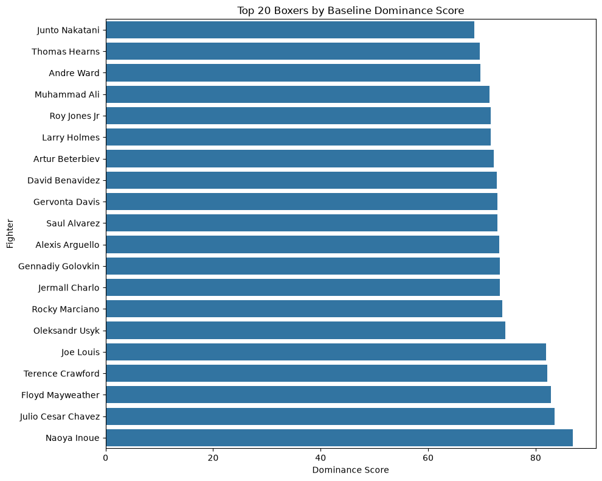
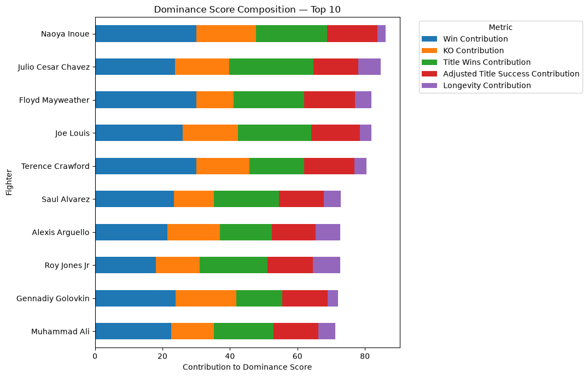
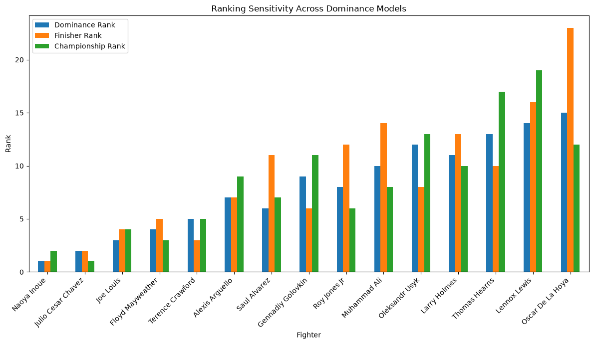

# Boxing Dominance Analysis

A data analysis project that compares 75 professional boxers across different eras to explore what makes a fighter statistically "dominant".

The project builds a custom dominance score using several career-performance metrics, including win percentage, knockout percentage, title-fight performance, and career longevity. The metrics are normalised and combined using a weighted scoring model to produce an overall ranking.

The project also includes sensitivity analysis to test how much the final rankings change when different metric weightings are used.

## Project Goals

This project aims to:

- Build a structured dataset of 75 notable professional boxers.
- Compare fighters from different eras using consistent career-level statistics.
- Create a reproducible definition of boxing dominance.
- Rank fighters using a weighted multi-metric scoring model.
- Examine which metrics contribute most to each fighter's score.
- Test how sensitive the rankings are to different weighting choices.

## Dataset

The final dataset contains 75 professional boxers from different eras and weight classes.

Each fighter includes the following career-level information:

- Fighter Name
- Weight Class(es)
- Wins
- Losses
- Draws
- No Contests
- Total Fights
- Record
- KO Wins
- KO %
- KO Losses
- Debut Year
- Years Active
- Championship Titles
- BoxRec ID
- Stoppage Win %
- Decision Win %
- Title Fight Wins
- Title Fight Losses

Additional metrics such as career length, win percentage, title-fight totals, and adjusted title success are calculated during the analysis rather than stored directly in the original dataset.

### Data Preparation

Before building the dominance model, the dataset was checked for:

- Missing values
- Duplicate fighters
- Invalid or inconsistent records
- Percentage ranges
- Fight totals
- Numeric data types

Active fighters listed with `Present` in their career span are treated as active through 2026 for career-length calculations.

## Dominance Metrics

The dominance model uses five career-level metrics:

- **Win %** — measures how consistently a fighter won across their professional career.
- **KO %** — measures the proportion of wins achieved by knockout or technical knockout.
- **Title Fight Wins** — rewards fighters who repeatedly won at championship level.
- **Adjusted Title Success** — measures title-fight success while reducing the advantage of fighters with a perfect percentage from only a small number of title fights.
- **Career Length** — represents longevity at professional level.

Each metric captures a different aspect of dominance, allowing the final score to consider both performance and sustained success.

## Dominance Score

Because the metrics use different scales, each metric is first normalised using min-max normalisation so that all values fall between 0 and 1.

The baseline dominance score uses the following weights:

- Win %: **30%**
- KO %: **20%**
- Title Fight Wins: **25%**
- Adjusted Title Success: **15%**
- Career Length: **10%**

The normalised metrics are multiplied by their respective weights and added together to produce each fighter's final **Dominance Score**.

Fighters are then ranked from highest to lowest Dominance Score.

## Results

Using the baseline dominance model, the highest-ranked fighters were:

| Rank | Fighter | Dominance Score |
|---:|---|---:|
| 1 | Naoya Inoue | 86.06 |
| 2 | Julio Cesar Chavez | 84.61 |
| 3 | Joe Louis | 81.99 |
| 4 | Floyd Mayweather | 81.99 |
| 5 | Terence Crawford | 80.43 |
| 6 | Saul Alvarez | 72.88 |
| 7 | Alexis Arguello | 72.68 |
| 8 | Roy Jones Jr | 72.63 |
| 9 | Gennadiy Golovkin | 72.05 |
| 10 | Muhammad Ali | 71.17 |

The ranking reflects the specific definition of dominance used in this project rather than attempting to produce an objective all-time pound-for-pound list.

### Score Interpretation

A high Dominance Score can be achieved through different combinations of strengths.

For example, some fighters score highly because of exceptional win and knockout percentages, while others benefit more from championship success or long careers.

This allows the model to reward different forms of dominance rather than relying on a single statistic.

## Sensitivity Analysis

The baseline weights represent one interpretation of boxing dominance, so two alternative weighting systems were tested to examine how sensitive the rankings are to different definitions.

### Finisher-Heavy Model

This model places greater emphasis on knockout ability:

- Win %: **30%**
- KO %: **30%**
- Title Fight Wins: **15%**
- Adjusted Title Success: **15%**
- Career Length: **10%**

### Championship-Heavy Model

This model places greater emphasis on championship-level success:

- Win %: **25%**
- KO %: **10%**
- Title Fight Wins: **35%**
- Adjusted Title Success: **20%**
- Career Length: **10%**

The rankings from the baseline, finisher-heavy, and championship-heavy models are then compared directly.

### Ranking Stability

For each fighter, the project calculates:

- Best Rank
- Worst Rank
- Average Rank
- Rank Range

A small Rank Range indicates that a fighter remains highly ranked even when the definition of dominance changes.

Several of the highest-ranked fighters were very stable across all three models. For example:

| Fighter | Baseline Rank | Finisher Rank | Championship Rank | Rank Range |
|---|---:|---:|---:|---:|
| Naoya Inoue | 1 | 1 | 2 | 1 |
| Julio Cesar Chavez | 2 | 2 | 1 | 1 |
| Joe Louis | 3 | 4 | 4 | 1 |
| Floyd Mayweather | 4 | 5 | 3 | 2 |
| Terence Crawford | 5 | 3 | 5 | 2 |

This suggests that the top of the ranking is relatively robust to reasonable changes in the weighting system.

## Visualisations

### Top 20 Boxers by Dominance Score



This chart shows the 20 highest-ranked fighters under the baseline dominance model.

### Dominance Score Composition



This stacked bar chart shows how each metric contributes to the total Dominance Score for the top 10 fighters.

### Ranking Sensitivity



This chart compares fighter rankings across the baseline, finisher-heavy, and championship-heavy weighting models, making it easier to see which fighters remain stable when the definition of dominance changes.

## Limitations

This project has several limitations that should be considered when interpreting the rankings:

- **Subjective weighting:** The dominance score depends on the chosen metric weights. Sensitivity analysis helps test this, but no weighting system can be considered objectively correct.
- **Historical comparability:** Fighters competed under different rules, schedules, title structures, and competitive environments across eras.

- **Data availability:** Detailed statistics are less complete and less standardised for older fighters, which limits the types of metrics that can be compared consistently across all 75 fighters.

- **Opponent quality:** The current model does not directly measure the strength of each fighter's opposition.

- **Title differences:** Championship structures have changed significantly over time, meaning title-fight statistics are not perfectly comparable between eras.
- **Career status:** Active fighters may continue to change their records and rankings as their careers progress.
- **Metric scope:** The model focuses on career-level outcomes and does not include detailed in-fight statistics such as punch accuracy, defence, knockdowns, or round-by-round performance.

The final rankings should therefore be interpreted as the output of this specific statistical model rather than a definitive ranking of the greatest boxers of all time.

## Project Structure

```text
boxing-dominance-analysis/
│
├── charts/
│   ├── top_20_dominance.png
│   ├── top_10_score_composition.png
│   └── ranking_sensitivity.png
│
├── data/
│   ├── boxing_dominance_rankings.csv
│   └── ranking_sensitivity.csv
│
├── notebooks/
│   ├── 01_data_exploration.ipynb
│   └── 02_dominance_model.ipynb
│
├── .gitignore
└── README.md
```

- `01_data_exploration.ipynb` — explores, validates, and prepares the boxing dataset.
- `02_dominance_model.ipynb` — creates the dominance score, rankings, visualisations, and sensitivity analysis.
- `data/` — contains the generated ranking outputs.
- `charts/` — contains visualisations generated by the analysis.

## How to Run

1. Clone the repository:

```bash
git clone https://github.com/RichMcBoss0P/boxing-dominance-analysis.git
```

2. Open the project folder in VS Code.

3. Install the required Python packages:

```bash
pip install pandas numpy matplotlib
```

4. Open and run:

```text
notebooks/01_data_exploration.ipynb
```

5. Then run:

```text
notebooks/02_dominance_model.ipynb
```

The first notebook performs the data exploration and validation, while the second notebook builds the dominance model and produces the final rankings, sensitivity analysis, and charts.

## Technologies Used

- Python
- pandas
- NumPy
- Matplotlib
- Jupyter Notebook
- Visual Studio Code
- Git
- GitHub